#Editing Tasks#

There are tools for various editing tasks built into the ODMTools Python interface. Some of these tools are used to select points while others are used to perform edits on selected values. Custom editing tasks and functions can also be created and executed through the Python console. The 'Edit' tab also includes the funcationality for saving or restoring data series. 

##Selecting Points##

Points representing individual data values can be selected using the table interface, the plot interface, or the filtering tools. Data values must be selected before they can be edited. When a data series is being edited, the values are loaded into the table. Clicking on a row will select that point in the plot indicated by the color changing to red. Holding down the left mouse button while dragging over several records or using ctrl+click and shift+click in the table allows for the selection of multiple points. 

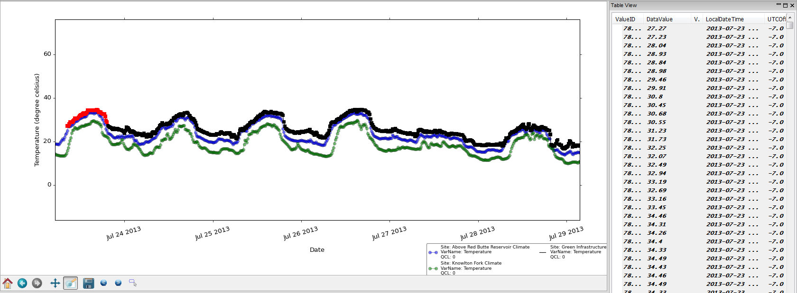

To select data points on the plot, use the 'Lasso Select' button in the plot toolbar. With the lasso active, the cursor can be used to draw a shape around points to select them. This can be used to select consecutive points and/or points of similar values. To begin selection, click on the plot window. This will initiate the lasso. Each click of the mouse will define a point on a polygon. Points within the polygon will be selected, indicated by the color changing to red. The corresponding points are highlighted in the table. 

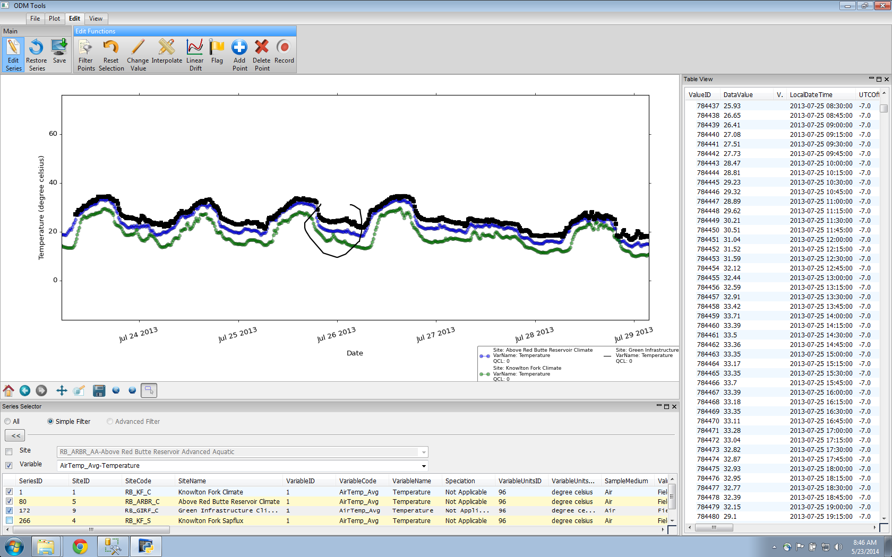

Note that when points are selected and an editing action performed, the points will remain selected until de-selected. This permits multiple actions to be performed on the same set of points (e.g., interpolation and flagging). Also note that if 'Record' is active, all selections and de-selections will be recorded in the Python Script window.

##Filtering Points##

The editing interface includes filters that select data values based on user-specified criteria. Filter types include Value Threshold, Data Gaps, Date Range, and Value Change Threshold. To use any of these filters, click on the radio button corresponding to the filter and enter the appropriate criteria value(s). Clicking the 'Apply' button shows the points selected by the filter, and clicking the 'OK' button implements the filter. Clicking the 'Clear Filter' button removes all filters. Selected points are indicated by red points on the plot and highlighted rows in the table.

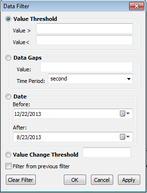

    -*Value Threshold:* This filter is useful for identifying data values that fall outside of an expected range for a variable. Entering a number in the 'Value >' box is used to select all points greater than that value, and entering a number in the 'Value <' box is used to select all points less than that value. Both critera can be used to select a set of points between two values. 
    -*Data Gaps:* This filter is useful to identify gaps in a data series that may be caused by instrument malfunctions or lost power. With high frequency data, these gaps are often short enough that they are not discovered using a visual inspection. This filter selects points at the beginning and the end of a user-defined gap of time in the data values. A numeric value representing the value of the time interval is entered and the time period units (seconds, minutes, hours, days) are selected from the dropdown.
    -*Date Range:* This filter is used to isolate data values based on associated date, which is helpful when it is known that a sensor malfunction or an environmental event invalidated data for a certain time period. To use the filter, in the 'Before' and/or 'After' boxes, click on the month/day/year and use the arrow buttons or type. The calendar dropdowns can also be used. The date range permits selection of of data before a specific date, after a specific date, betewen two dates, as well as before a specific date AND after a certain date (i.e., the period between the dates will not be selected). Note that times have not been implemented in the current version, but will be implemented in the future.
    -*Value Change Threshold:* This filter is useful to identify instances of rapid change in the data values, which may indicate natural occurances or anomalous data values. This filter selects subsequent pairs of points with a value difference greater than the number entered as the criterion. 

##De-selecting Points##

Points can be de-selected in several ways. Clicking on any record in the table clears the previous selection of points and selects the point that is clicked on. Using the lasso tool to select points will de-select any previously selected points. If the 'Data Filter' dialog is open, the 'Clear Filter' button will clear the selection of points that were made using the filter. Finally, there is a 'Reset Selection' button in the ribbon, which will clear all selections in the data series.

##Deleting Points##

ODM Tools Python allows for the deletion of points from a data series (remember that these points should not be deleted from the raw, QC0 record), which is useful to remove erroneous values due to improper configuration, invalid environmental conditions, or instrument error. Points should be selected using the methods described in the Selecting Points or Filtering Points sections. To delete selected values, click on the 'Delete Point' button in the ribbon. A warning will appear to verify the deletion.

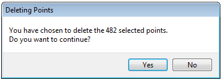

##Change Value of Points##

ODM Tools Python has built-in functionality to change the values of selected data points by adding, subtracting, multiplying by, or setting equal to a constant value. Applying a constant shift or multiplier may be useful for applying an offset or coefficient to a portion of a data series or adjusting for an incorrectly applied constant in the datalogger program. Setting values equal to a constant is useful when data are invalid and need to be set to 'No Data' value or to some detection limit. To adjust data values, select points using the methods described in the Selecting Points or Filtering Points sections and click on the 'Change Value' button in the ribbon. A dialog box will appear allowing selection of the type of adjustment to make and the constant value to use.

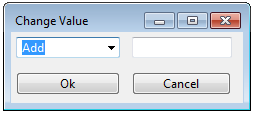

##Interpolate Points##

ODM Tools Python includes a function for linear interpolation of selected values. This is useful for filling a brief data gap or adjusting a spurious data value when it is obvious that the values should follow a linear pattern with previous and subsequent data values (e.g., two points are erroneous due to a sensor being cleaned as part of a field visit). To interpolate points, select points of interest using the methods described in the Selecting Points or Filtering Points sections. Use the 'Interpolate' button in the ribbon. Points will be immediately be interpolated based on the previous and subsequent values.

The interpolate function can only be performed on existing points, so if a data gap needs to be filled, points must first be added as described in the Inserting Data Values section and then interpolated. When points are added, the assigned values can be arbitrary as they will be replaced by interpolation. 

##Linear Drift Correction##

Drift correction is important for data from sensors that are prone to drift over time and for sensors that undergo calibration. Data that have shifted may be brought back into sync by performing a drift correction. ODM Tools Python has the ability to apply linear drift corrections. Additional drift correction types (i.e., multipoint) may be implemented in future versions.

A linear drift correction uses two reference values at the beginning and end of the period of correction with a gap value, the difference between the final observation and the target value, to bring the observation in sync. The correction is applied retrospectively with each previous data value recieving a proprotionately smaller correction until the first reference value is reached. 

To apply a linear drift correction, select the set of points to which the correction will be applied using the methods described in the Selecting Points or Filtering Points sections. For a calibration correction, the first value selected should be the point where it is known that drift began or the point following the previous calibration. The final value should be the point just prior to calibration. Click on the 'Linear Drift' button in the ribbon. A dialog box will appear prompting the entry of the 'Final Gap' value. As noted in the dialog box, a negative value will move points down and a positive value will move points up.

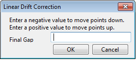

##Flagging Data Values##

When data values are questionable or when an edit has been performed on data values, it may be desired to flag them with a data qualifying comment. When analyses are performed on the data, these annotations can help make it clear that the data are suspect or that they have been modified. For example, values that have been interpolated should be flagged with a data qualifier indicating interpolation. Also, users may want to flag values that are suspect due to environmental conditions such as ice or sediment affecting sensor readings.

To apply a flag, select the points of interest based on the methods in the Selecting Points or Filtering Points sections. If points have already been selected for an editing action, they will remain selected and a qualifier can be applied. Click the 'Flag' button in the ribbon. A dialog box will appear prompting selection of a qualifier from a dropdown. If the desired qualifier is not present in the database, 'Create New...' can be selected and a code and descriptor created in the following dialog box. The new qualifier will be applied to the selected points.

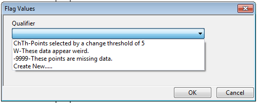
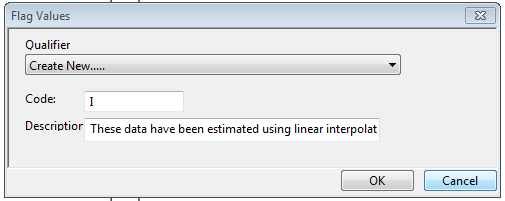

##Inserting Data Values##

ODM Tools Python includes the ability to insert values into data series. This functionality adds individual points and is not designed to fill large gaps. This may be necessary when an aquatic sensor is out of the water for a calibration or a when datalogger malfunctions and a measurement at the typical time is missed. To add a data value, click on the 'Add Point' button in the ribbon. A table form appears. The fields in this form correspond to the fields in the DataValues table in the ODM database. Required fields (DataValue, LocalDateTime, UTCOffset, UTCDateTime, CensorCode) are shown in yellow. Fields with controlled vocabularies use dropdowns with available options (OffsetType, CensorCode, QualifierCode). Site, variable, method, source, and quality control information are not shown as they remain consistent with the other values in the data series. Enter the point value and metadata and click 'Save' to add the point to the series.

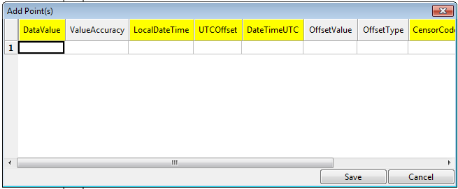

##Saving Edits to Data Series##

ODM Tools Python stores all edits in memory until the user commits them to the database. Edits can be saved as a new data series, which retains unchanged the base data series on which edits were made. This is important when performing quality control post processing on raw sensor data. The raw data should not be overwritten, but should be saved as a higher level data product (i.e., quality control level 1). This is also useful for deriving new data products from existing series (e.g., discharge derived from stage). Alternatively, edits can be saved to the same data series for cases when editing a data series is performed in multiple sessions. The edits made in the first session would be saved as a new data series and future sessions would work off of that existing series.

 To save the edits made to the database, click on the 'Save' button in the ribbon, which will initiate the Save dialog. Choose the appropriate radio button- either 'Save' to save to the existing data series or 'Save As' to save to a new data series.

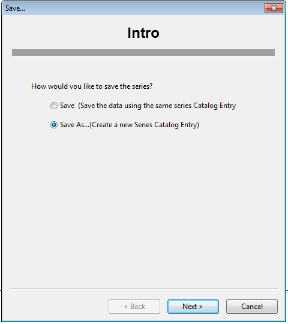

 If 'Save' is selected, a summary of the series metadata will be shown. Clicking 'Finish' will prompt several times to verify that the series should actually be overwritten.

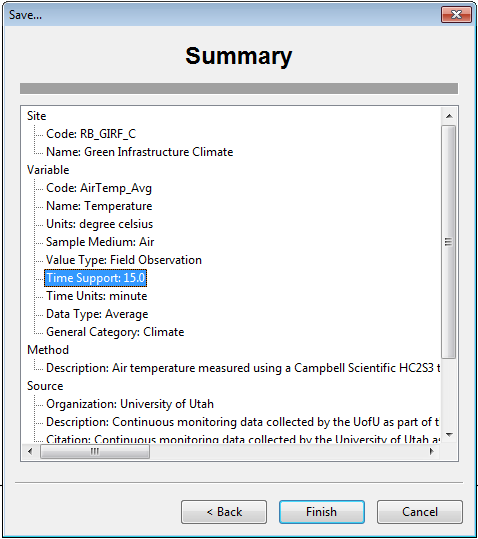
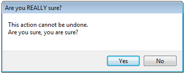

 If 'Save As' is selected, the Save dialog will prompt the user to define metadata information for the data series. Existing information from the database can be used or new entries can be created for the data series being saved.
 -*Method:* There are three options: the program can automatically generate a method, an existing method can be used, or a new method can be created. For an existing method, select an entry from the database. For a new method, type a description in the text box.

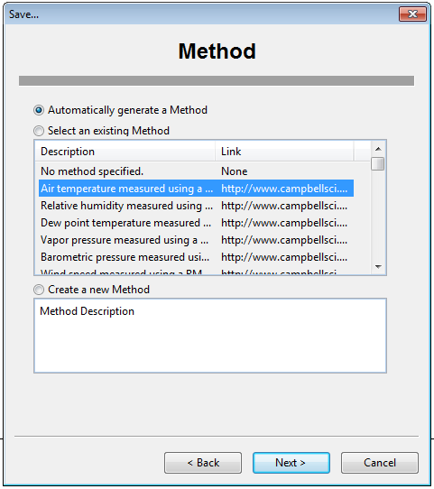

 -*Quality Control Level:* An existing quality control level can be selected or a new one can be created. Choose an existing quality control level from the table, or enter a Code, Definition, and Explanation for a new quality control level.

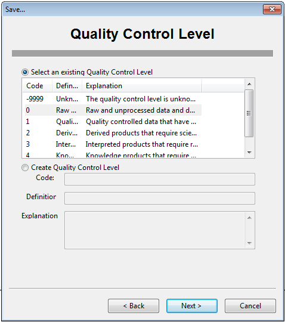

 -*Variable:* Options are to use the current variable, select an existing variable form the database, or create a new variable. For an existing variable, select from the table. Selecting the radio button to create a new variable will bring up a form for entering the necessary variable attribute information. Currently, this form is not fully functional.

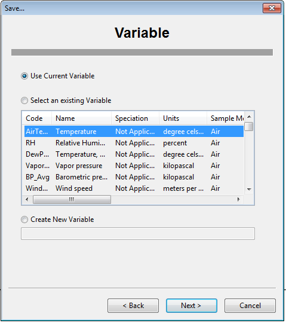 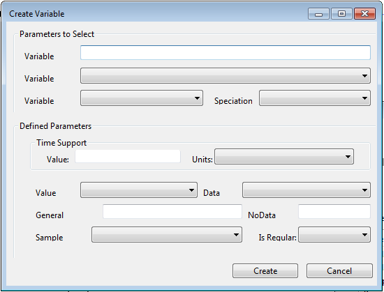

 After completing the information for all of these metadata entries, the Save dialog will display a summary for review before the series is saved. 

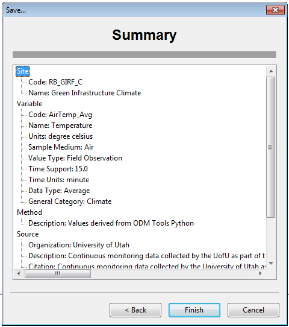

##Restoring Data Series##

Because ODM Tools Python holds edits in memory until the user commits them to the database, the original data values can be restored at any time during the edit session prior to saving edits. To restore the data series to the original values, click the 'Restore Series' button in the ribbon. This will restore all edits that have not been committed to the database. The functionality to 'undo' individual editing steps is not implemented as a built-in function of ODM Tools Python, but it can be performed by using the Python Script (i.e., the data series are restored to original values, and the desired steps recorded in the script are run). 