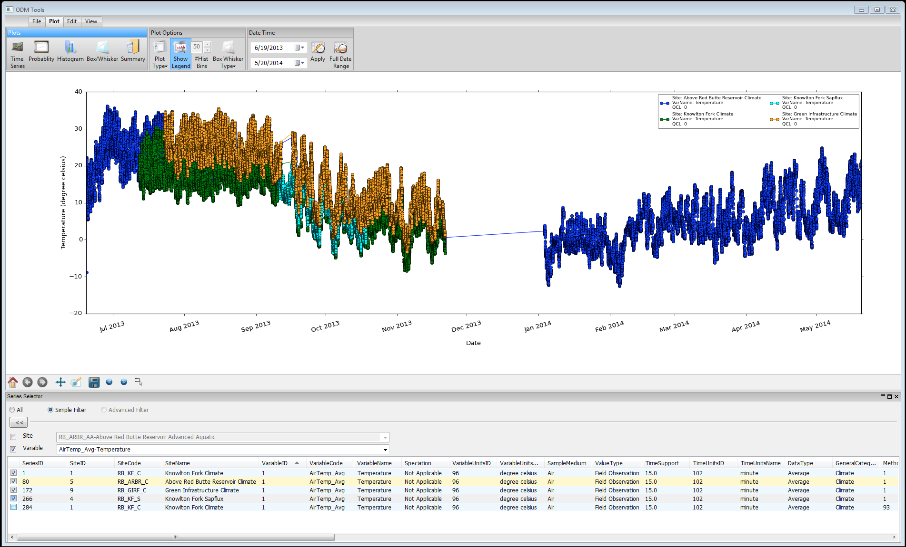
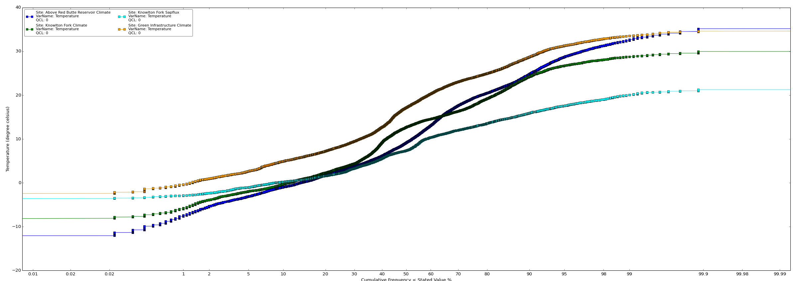
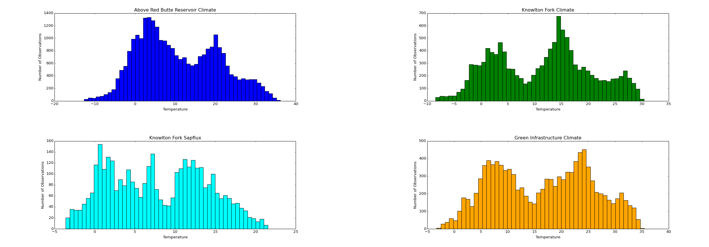
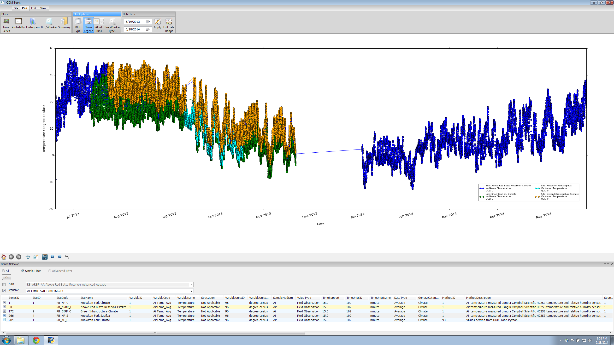
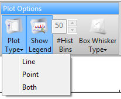
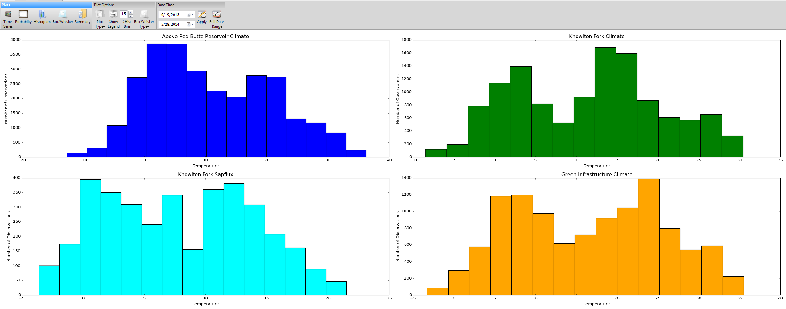
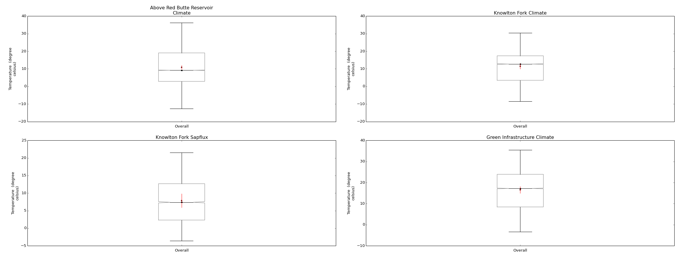
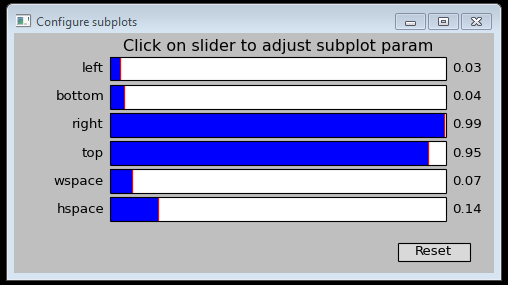
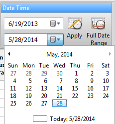
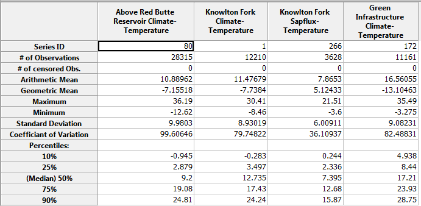

#Visualizing Data Series#

The 'Plot' tab is used to visualize data series. Series are selected for plotting using the Series Selector table. By default, series are plotted on a time series plot. Additional available plot types are Probability, Histogram, and Box and Whisker. The Plot window also permits the viewing of 'Summary' statistics of the data series selected. The different plot types and summary statistics are accessed by clicking on the corresponding buttons in the ribbon.

##Multiple Data Series##

Multiple data series can be plotted by toggling the checkboxes to the right of each series entry in the Series Selector table. Up to six data series may be selected for plotting at once. Different color symbology is automatically assigned to each new series that is plotted. For time series and probability plots, series are plotted in the same frame. For histogram and box and whisker plots, each data series is plotted in its own frame, so there may be multiple subplots in the plot window.

When series of the same variable and unit are selected, they will share a y-axis in the time series and probability plots. When series with different variables are selected, additional y-axes will be added to the plot. Current functionality does not permit the user to edit the axes and their ranges, though that may be implemented in the future. 

##Legend##

Multiple data series plotted together necessitate the display of a legend. The 'Legend' button in the ribbon is clicked to display (or hide) a Legend, which references the symbology to the corresponding data series. The legend entry includes 'Site' with the SiteName, 'Var' with the VariableName, and 'QCL' with the QualityControlLevel. Clicking and dragging the legend repositions it anywhere on the plot window. Note that the legend is only applicable to the Time Series and Probability Plots.

##Plot Options##

Each plot type has associated customization options that can be accessed in the ribbon and the toolbar. Options are only available for the particular plot type that is being veiwed. The following describes the plot options by plot type.

###Time Series Plot and Probability Plot###

The 'Plot Type' dropdown button in the ribbon allows shifting the plot symbology between points, lines, or both points and lines for view on the Time Series and Probability plots. Note that the colors are automatically assigned, and current functionality does not permit them to be changed. The Legend is also available as a plot option for Time Series and Probability Plots. The following screen shots shows plots with the lines option selected.

###Histogram###

The number of bins/bars in the histogram can be changed using the entry for '# Hist Bins' in the ribbon. The number of bins can range between 0 and 99 with a default of 50. Note that for multiple data series, the number of bins is consistent for all of the series plotted. The following image shows histograms with 15 bins.

###Box and Whisker###

The 'Box Whisker Type' dropdown button in the ribbon changes the time period over which values are grouped for the box and whisker plot. Values can be grouped by month, by season, or overall, which puts all of the values into one group. Note that for multiple data series, the grouping period will be the same for all of the series plotted. The following image shows a box and whisker plot with overall grouping.

###Subplot Option###

When viewing histograms or box and whisker plots with multiple data series, the subplot dimensions can be edited using the 'Subplot' button  on the Toolbar. The subplot configuration box (shown below) consists of sliders that edit the space between and around the subplots. The 'left', 'bottom', 'right', and 'top' sliders adjust the margins around the perimater of the full plot window. The 'wspace' slider adjusts the space between the plots width-wise, and the 'hspace' slider adjusts the space between the plots height-wise. The sliders can be drug to the right to increase margins or to the left to decrease margins. Clicking the 'Reset' button puts the sliders back to the defaults, as indicated by the red lines in the sliders.

##Restricting the Date Range##

The default behavior is to plot the full date range of the values in a data series. The series can be subsetted for the plot and summary statistics by by using the Date Range box in the Ribbon. The BeginDateTime and EndDateTime default to the full range of the series being plotted. To change the date range, click on the month/day/year in the date boxes and type or use the up/down arrows to adjust the date, or use the dropdown calendar to select a date. After setting the dates as desired, click 'Apply'. To restore the full date range, click the 'Full Date Range' button. Note that current functionality only supports the selection of dates but not times. Also, it will not permit the entry of a date that does not exist in the data series, so if the data series begins 9/15/2013, and you want to use 1/1/2014 as the start date, you will not be able to enter the date by typing because the date range tool will first see 1/15/2013, which does not exist in the data series.

##Plot Tools: Zooming and Panning##

The toolbar at the bottom of the plot window features tools for interacting with the plot, notably zooming and panning. 
    - When the Zoom button is selected, left clicking on the plot and holding the mouse down draws a box around the area to which the plot will zoom. Right clicking and drawing a box will zoom out on the plot. 
    - When the Pan button is selected, clicking and dragging on the plot will pan over the plot. 
    - The Right and Left Arrow buttons can be used to pan forward and backward in time. 
    - The Back and Forward buttons revert to a previous (or subsequent) view if the zooming/panning were changed. 
    - The Home button will return to the original, default plot prior to any zooming/panning.

##Summarizing Data Series##

Descriptive statistics are provided for the series selected for plotting and are accessed by clicking on the 'Summary' button in the ribbon. If the date range is restricted, the statistics will be calculated for that subset of the data series. The summary statistics include observations counts, range, means, standard deviation and coefficient of variation, and percentiles. The number of censored observations is included for reference. Currently, statistics are calculated on all values regardless of censorship. The following image shows a screenshot of the summary statistics table. 

##Saving a Plot##

The plots generated in ODM Tools Python can be exported and saved for use in documents and presentations. To save a plot, click on the 'Save' button  in the toolbar. A save dialog will appear to prompting the user to provide the save location, a name for the image, and the file type to save the image as. Supported image types are encapsulated postscript (.eps), LaTeX pgf figure (.pgf), portable document format (.pdf), portable network graphics (.png), postscript (.ps), raw RGBA bitmap (.raw, .rgba), and scalable vector graphics (.svg, .svgz).
